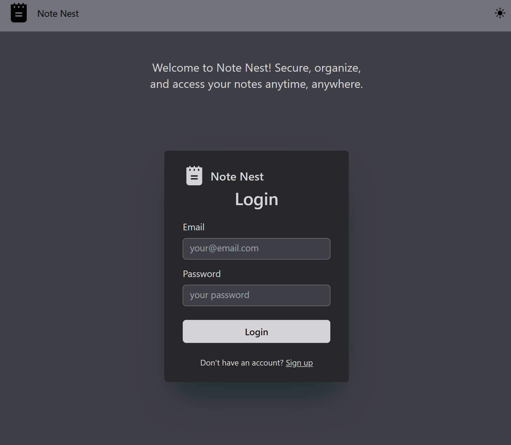

# Note Nest

A full-stack Notes application (Google Keep Clone) built with the MERN stack (MongoDB, Express, React, Node.js), TailwindCSS with JWT-based user authentication and authorization. The app allows authenticated users to perform CRUD operations on their notes.

## Screenshots



## Features

- **User Authentication**: Secure user login and signup using JWT tokens.
- **Authorization**: Only authenticated users can access the app and perform operations.
- **CRUD Functionality**: Authenticated users can create, read, update, and delete their notes.
- **Frontend**: Built with React and Vite for fast and optimized development.
- **Backend**: RESTful API built with Express and Node.js, integrated with MongoDB for data storage.

## Tech Stack

- **Frontend**: React, Vite, TailwindCSS
- **Backend**: Node.js, Express, MongoDB, JWT (JSON Web Token) for authentication
- **Database**: MongoDB
- **Tools**: Git, Postman (for API testing)

## Getting Started

### Prerequisites

- [Node.js](https://nodejs.org/)
- [MongoDB](https://www.mongodb.com/)

### Installation

1. **Clone the repository**:
   ```bash
   git clone https://github.com/adarsh78/notenest.git
   cd notenest
   ```

## Backend Setup

1. **Navigate to the backend directory from the root**:

   ```bash
   cd backend

   ```

2. **Install dependencies:**:

   ```bash
   npm install

   ```

3. **Set up environment variables in a .env file**:
   ```plaintext
   PORT=3010
   MONGO_URI=your_mongodb_connection_string
   JWT_SECRET=your_jwt_secret

   ```

4. **Start the backend server**:
   ```bash
   npm run start

   ```

## Frontend Setup

1. **Navigate to the frontend directory from the root**:

   ```bash
   cd frontend

   ```

2. **Install dependencies:**:

   ```bash
   npm install

   ```

4. **Start the development server**:
   ```bash
   npm run dev

   ```

## Access the App

- Open the localhost url which you got while running npm run dev for frontend.
- For the backend you will see the localhost url in the terminal while running the npm run start command.


## Authentication

- JWT is used for secure authentication. After logging in, the user receives a JWT token, which should be included in the Authorization header (Bearer token) for protected routes.

## API Endpoints

| Method | Endpoint         | Description                   |
|--------|-------------------|-------------------------------|
| POST   | `/api/auth/signup` | User registration             |
| POST   | `/api/auth/login`  | User login                    |
| GET    | `/api/todos`       | Fetch all notes (auth required)|
| POST   | `/api/todos`       | Create a new note (auth required) |
| PUT    | `/api/todos/:id`   | Update a note (auth required) |
| DELETE | `/api/todos/:id`   | Delete a note (auth required) |
